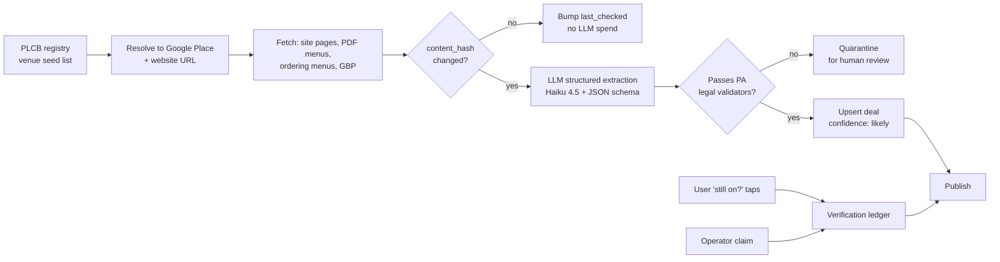

# Happy Hour Finder — Product & Technical Spec
**Seed market: 20-mile radius around King of Prussia, PA**
Draft 1 — 2026-07-31

---

## 1. The thesis

Happy hour listings are not a content problem. They are a **freshness** problem.

Every dead happy-hour app died the same way: it scraped a few hundred venues once, launched a
pretty map, and became a graveyard of 2019 specials within eight months. Users open it, drive to
a bar, find no happy hour, and never open it again. One bad result destroys more trust than ten
good ones build.

So the product is not "a database of happy hours." It is:

> **A live answer to "where can I go in the next 30 minutes, and is the deal actually still on?"**

Everything in this spec is organized around that. The freshness engine (§6) is the product; the
map is the wrapper.

**The second thesis:** deal data has a legal shape in PA that makes it *far* more tractable than
it looks. See §3.

---

## 2. Geography — the 20-mile radius has a problem

King of Prussia sits at roughly **40.089° N, −75.396° W**. A naive 20-mile radius from there is
not a suburban Montgomery County app. Straight-line distances:

| Destination | Approx. straight-line miles | In radius? |
|---|---:|---|
| Conshohocken, Wayne, Ardmore, Norristown | 3–8 | ✅ |
| Media, West Chester, Phoenixville, Blue Bell | 10–16 | ✅ |
| Manayunk / Roxborough | ~11 | ✅ |
| **Philadelphia City Hall** | **~15.4** | ✅ ← the problem |
| Camden, NJ | ~17.6 | ✅ ← the other problem |
| Wilmington, DE | ~24 | ❌ |
| Trenton, NJ | ~33 | ❌ |

**Two consequences:**

1. **Center City swamps the dataset.** Philadelphia has an order of magnitude more licensed
   venues per square mile than the Main Line. A radius-sorted list from a KoP user will be ~70%
   Philly bars they will never drive to on a Tuesday. Rank by *drive time*, not crow-flies
   distance, and default the KoP user to a suburban view.
2. **The radius crosses a state line.** Camden County NJ is inside 20 miles, and New Jersey's
   happy-hour regime is **different from Pennsylvania's**. Different legal shape = different
   validation rules = different schema constraints (§3). Recommend **excluding NJ from v1** and
   noting it as a deliberate scope cut rather than silently half-supporting it.

### Recommendation: zones, not a radius

Browse by **named district**, not by circle. This region's drinking is clustered into walkable
strips, and that maps directly to how people actually decide:

| Zone | Anchor strip |
|---|---|
| King of Prussia | Mall district, Henderson Rd, Gulph Mills |
| Conshohocken | Fayette St |
| Wayne / Radnor | Lancaster Ave |
| Ardmore / Bryn Mawr | Suburban Square, Lancaster Ave |
| Norristown / Bridgeport | Main St, DeKalb |
| Phoenixville | Bridge St |
| West Chester | Gay St |
| Media | State St |
| Manayunk | Main St |
| Collegeville / Trappe | Ridge Pike |
| Blue Bell / Plymouth Meeting | Butler Pike |
| Philadelphia — Center City | *(opt-in, off by default for KoP users)* |

A zone list unlocks the crawl feature (§7) and solves the Philly-swamp problem in one move.

**Corpus size, order of magnitude:** roughly 2,500–3,500 active retail liquor licensees fall
inside the disc (Montgomery + Delaware + eastern Chester + Philadelphia west/center). If 30–50%
run a real recurring happy hour, the addressable corpus is **~1,000–1,500 venues** — small enough
to be genuinely comprehensive, large enough to be defensible. Verify against the PLCB licensee
database before committing (§5).

---

## 3. PA liquor law is the schema

This is the single most useful discovery in this spec. Pennsylvania constrains happy hour by
statute, and those constraints are free validation rules.

**Current PA rules (Acts 57 & 86 of 2024, effective 2024-09-16):**

| Rule | Value | Use as |
|---|---|---|
| Max discount hours per **day** | 4 | Hard schema constraint |
| Max discount hours per **week** | **24** (raised from 14) | Hard schema constraint |
| Discount pricing between midnight and close | **Prohibited** | Any record with a post-midnight deal is bad data |
| Separate "daily drink special" allowed | 1 type of beverage, may run all day | Second deal type |
| Food + drink combo specials | Up to 2 per day | Third deal type |
| All-you-can-drink / free drinks / bigger pour at same price | **Prohibited** | Never render such a claim |
| Advertising happy hour | Permitted; ad must identify the licensee | Legal to aggregate and display |

### Three deal types, derived from the law

```
deal.type ∈ { happy_hour, daily_special, food_combo }
```

- `happy_hour` — a bounded window (≤4h/day, ≤24h/week), ends by midnight
- `daily_special` — one beverage type, may run open→close ("$4 Yuengling all day Tuesday")
- `food_combo` — bundled food+drink price, max 2/day

### Free validation rules

Anything that violates the statute is a **parsing bug or a stale record**, not a venue that broke
the law. Flag, don't publish:

- A window totalling >4h on one day
- Weekly total >24h
- Any window extending past 00:00
- "All you can drink", "bottomless", "free drink with entrée"
- More than 2 food-combo deals on one day

**Bonus:** the 14→24 hour expansion in **Sept 2024** means a large share of published happy-hour
content on the web predates the current reality. Venues expanded their windows; listicles didn't.
That's a freshness argument you can point at, and a reason a from-scratch dataset beats an
inherited one.

⚠️ Treat the table above as researched-but-verify. Confirm against the PLCB's current advisory
notice on discount pricing practices before putting legal claims in user-facing copy. The *app*
never asserts law to users — it just uses these as internal validators.

---

## 4. Data model

```
venue
  id, name, slug
  address, lat, lng, zone_id
  plcb_license_id, license_type        -- R / E / H / club — from the PLCB registry
  phone, website, instagram
  google_place_id
  tags[]                               -- patio, dog_friendly, kid_friendly, sports,
                                       --   trivia, live_music, pool, arcade, parking_free
  accessibility { step_free_entry, accessible_restroom }
  status ∈ { open, temporarily_closed, permanently_closed }

deal
  id, venue_id
  type ∈ { happy_hour, daily_special, food_combo }
  windows[]        -- [{ dow: 1..7, start: "16:00", end: "18:00" }]
  items[]          -- normalized; see below
  fine_print       -- "bar area only", "dine-in only", "excludes holidays"
  source_id
  confidence ∈ { verified, likely, unconfirmed, disputed }
  first_seen_at, last_verified_at, verified_by ∈ { operator, user, crawler, staff }

deal_item                              -- THE differentiator: normalize the price
  category ∈ { draft, bottle_can, wine, well, call, cocktail, shot, food }
  label            -- "select drafts", "half-price apps", "$1 oysters"
  price_usd        -- 5.00        (null if percentage-only)
  discount_pct     -- 50          (null if absolute-price)
  normalized_value -- computed sortable "how good is this"

source
  id, venue_id, url, kind ∈ { venue_site, pdf_menu, gbp, instagram, facebook,
                              aggregator, user_report, operator_claim }
  content_hash, fetched_at, http_status

verification                           -- append-only ledger
  id, deal_id, verdict ∈ { still_on, not_anymore, wrong_price, wrong_time }
  actor ∈ { user, operator, crawler, staff }
  observed_at, geo_at_venue (bool), note
```

**Why `deal_item` matters.** Nobody else normalizes the price. "Half off drafts" and "$4 select
drafts" and "$2 off all beer" are three unsortable strings in every competing app. Parse them into
`price_usd` / `discount_pct` and you can rank by *actual value*, filter by "under $5", and answer
"cheapest draft within 3 miles right now" — which no listicle can do.

---

## 5. Where the data actually lives

Ordered by yield-per-effort:

| # | Source | Coverage | Freshness | Notes |
|---|---|---|---|---|
| 1 | **PLCB licensee registry** | ~100% of *venues* | Quarterly | Not deal data — but it's the ground-truth venue list + license type + address. Gives you a **denominator** and kills the "did we miss a bar?" problem. Verify the current public search/export endpoint; older PLCB API paths have been retired. |
| 2 | **Venue website `/happy-hour`, `/specials`, PDF menus** | 30–45% | Weeks–months | Highest quality when present. PDFs are common and are where most apps give up. |
| 3 | **Google Business Profile (Places API)** | ~95% of venues | Good for hours/status | Rarely has structured happy-hour data, but gives you name/address/hours/photos/permanently-closed signal cheaply. |
| 4 | **Toast / Square / Clover online-ordering menus** | 20–30% | Days | Underrated. Structured JSON, often reflects current pricing. |
| 5 | **Instagram / Facebook posts** | 40%+ | **Days** — the freshest source | ToS-hostile, unreliable, rate-limited. Treat as a *signal that something changed*, not as truth. |
| 6 | **Local editorial** (Philly Mag, Main Line Today, Visit Valley Forge, r/philadelphia, r/MainLine) | Long tail | Stale by design | Good for discovering venues you missed; bad for times and prices. |
| 7 | **The operator** (claim-your-listing) | 0% → the endgame | Real-time | See §10. This is where the moat is. |

### Extraction pipeline



**The content-hash gate is the whole cost story.** Re-fetching is nearly free; re-extracting is
not. Only pages whose relevant text actually changed go to the model.

### Extraction cost (Claude Haiku 4.5, $1 / $5 per MTok)

| Pass | Volume | Est. cost |
|---|---|---|
| Full corpus cold start | 1,500 venues × ~6K in / ~500 out | **~$13** |
| Same, via **Batch API** (50% off, ≤24h turnaround) | — | **~$6.50** |
| Weekly delta (~10% of pages change) | 150 venues | **~$1.30/wk** |

So the entire data-acquisition LLM bill is **under $20/month**. Use `output_config.format` with a
JSON schema so extraction output is guaranteed-parseable, and the Batch API for cold start and
weekly sweeps (latency is irrelevant for a nightly job). Reserve real-time calls for the
operator-facing "paste your happy hour text, we'll structure it" flow.

---

## 6. The freshness engine (the core of the product)

Every deal carries a **confidence** and an **age**, and both are shown to the user. No hiding.

### Confidence ladder

| Level | Earned by | UI treatment |
|---|---|---|
| `verified` | Operator confirmed, **or** ≥2 independent user "still on" reports in 30d | Green check, "Verified 3 days ago" |
| `likely` | Extracted from the venue's own site/menu within 60d, passes validators | Normal, "From their menu, June 2026" |
| `unconfirmed` | Extracted from a third party, or venue source >60d old | Dimmed, "Unconfirmed — call ahead" |
| `disputed` | ≥1 user "not anymore" report contradicting an unverified record | Struck through, held out of default results |

### Decay, not deletion

A deal never silently disappears. It **demotes**. Deleting looks like a bug to the user who saw it
yesterday; demoting with a visible timestamp reads as honesty and is the entire trust story.

```
age > 45d  → likely      → unconfirmed
age > 120d → unconfirmed → hidden from default, still on venue page
```

### Crowd verification — one tap, no account

On any deal card, when the user's device is within ~150m of the venue during the deal window:

> **Is this still on?**   [ Yes ]   [ No ]   [ Price changed ]

Geofencing the prompt is what makes this trustworthy — it means the reporter is standing there.
No login. One tap. Two independent yes-reports promote to `verified`.

### Make wrongness cheap to report

Every card gets a persistent, low-friction **"This was wrong"** link that captures deal id +
timestamp + optional note. Treat inbound corrections as the highest-value data in the system and
route them to a human queue daily. The cost of a wrong listing is a lost user; the cost of
reviewing a report is 20 seconds.

---

## 7. Product surface

### The default view is "Right now"

Not a directory. Not an A–Z list. A **time-ordered feed of what is live or starting soon**, sorted
by an urgency score:

```
score = f(minutes_remaining, drive_time, deal_value, confidence)
```

The hero card:

> **The Freehouse** — Conshohocken · 12 min drive
> **$5 drafts, half-price apps**
> 🔴 **Ends in 42 min** · Verified 2 days ago

"Ends in 42 min" is the killer line. It converts browsing into going.

### Time slider — BUILT, THEN REMOVED (2026-09-02)

The spec's reasoning was sound and the product disagreed with it. A board whose whole promise is
*what's on right now* was also asking the reader to set a time, and the strip label it painted —
"Arriving Fri 5:30pm" — read as a filter they had switched on by accident rather than a question
they had answered. Paul's words: "confusing as hell."

So the slider is gone from the strip. What survives:

- **The Day chips still work.** Picking a future day means "the evening" (16:00), which is the
  only thing anyone meant by "we're meeting at 6" anyway.
- **`state.offset` still exists** and is still read off the `#t=` hash, so an old shared link
  opens exactly as its sender saw it. Nothing writes it any more.
- `arrivalTime()` and `isNow()` are unchanged; the header clock IS the arrival moment.

The lesson worth keeping is not "sliders are bad": it is that **a control the reader did not ask
for reads as a filter they cannot see themselves having set.** The default view has to be the
whole answer, not a starting position.

### Table stakes

- Mobile web first, **no app install, no account to browse**
- Map + list, toggleable
- Filter: day, time, zone, deal type, price ceiling, food vs drink
- Deep link to Google Maps directions and to tap-to-call
- Venue page with all deals, hours, phone, photos, fine print
- Fast: the whole corpus should load in under a second (§9)

### What makes it great

Ranked by *differentiation × feasibility*:

1. **Food is the real driver.** Half-price apps and $1 oysters decide more evenings than $2 off a
   pint. Most competitors treat food as an afterthought. Index it as a first-class deal type and
   let people filter for it. This alone will separate the app.
2. **Sort by actual value.** Because `deal_item` is normalized (§4), you can offer "cheapest draft
   near me," "best food deal under $10," "≥40% off." Nobody else can do this.
3. **The crawl builder.** Pick a zone (Bridge St, Gay St, Fayette St, Main St Manayunk), and the
   app chains 3 venues whose windows overlap into a walkable route with timings: *4:30 at A,
   5:45 at B, 7:00 at C.* This is genuinely novel, it's perfectly suited to this region's
   geography, and it turns one visit into three.
4. **Group mode.** Happy hour is a group decision. Share a shortlist by link; everyone taps a
   thumbs-up; top pick wins. No accounts — the link *is* the session.
5. **"Ends soon" push.** Opt-in, one per day max: *"Thursday 4:15pm — 3 spots near you, one ends
   at 6."* This is the retention mechanic. Abuse it and you're uninstalled.
6. **Reverse / late happy hour as a filter.** PA caps discounts at midnight, so late deals top out
   around 9–11pm — a small, findable, underserved set.
7. **Vibe overlays.** Trivia night, live music, sports on, dog-friendly patio, kid-friendly (very
   real in the KoP/Main Line 4:30pm crowd), free parking, walkable-from-SEPTA. These are often the
   actual deciding factor once two places both have $5 drafts.
8. **Accessibility fields.** Step-free entry, accessible restroom. Almost nobody indexes this;
   for the people who need it, it's the difference between useful and useless.
9. **Radical honesty about staleness.** Show the verification age on every card. Counter-intuitive
   and correct: the app that says "unconfirmed — call ahead" is the one people keep.

### Deliberate anti-features

- ❌ No login wall to browse
- ❌ No native app requirement at launch
- ❌ No user reviews or star ratings — Google and Yelp own that, and it's a moderation tarpit
- ❌ No gamification, badges, or points
- ❌ No paid placement mixed into "right now" results (see §10)

---

## 8. Trust and correctness rules

1. Never display a deal that fails a PA legal validator (§3) — it is bad data by definition.
2. Never render a claim the source didn't make. If the menu says "select drafts," don't render
   "all drafts."
3. Always show verification age. Never present an extracted record as confirmed.
4. Store the source URL for every deal and link it from the venue page. Auditable by anyone.
5. Honor `robots.txt` and rate-limit crawls to something a small restaurant's shared host won't
   notice. These are the same businesses you may later want as customers.
6. Operator corrections override everything, immediately, no review queue.
7. Never geo-track in the background. Location is requested only in-session, and the geofenced
   verification prompt uses a one-shot position check.

---

## 9. Architecture

Match the existing akumal-scooters pattern — static front end, Cloudflare Worker for the small
dynamic surface. No servers.

```
Front end     Vanilla JS + a static site (GitHub Pages or Cloudflare Pages)
Data          Nightly build emits per-zone JSON bundles → R2/CDN
Writes        Cloudflare Worker + D1 (SQLite) — verifications, operator claims, reports
Ingestion     Python (stdlib + requests + dotenv), runs locally or on a cron
Extraction    Anthropic Batch API, Haiku 4.5, JSON-schema structured output
Images        R2, resized at ingest
```

### Why static-first

1,500 venues × ~400 bytes of essential fields ≈ **600 KB raw, ~120 KB gzipped** — and split by
zone it's ~10–20 KB per bundle. Ship the whole corpus to the client and do all filtering,
sorting, and "what's live right now" math in the browser. Result: instant interaction, zero
query cost, works on a bad signal in a parking lot, and the Worker only handles the tiny write
path. Revisit when the corpus exceeds ~10K venues, which is several markets away.

### Repo layout

```
happy-hour-finder/
  ingest/
    seed_plcb.py            # venue registry → venues table
    resolve_places.py       # Google Places enrichment
    fetch_sources.py        # crawl + content-hash gate
    extract_deals.py        # Batch API + JSON schema
    validate_pa.py          # legal validators (§3)
    build_bundles.py        # emit per-zone JSON
  worker/
    index.js                # verifications, reports, operator claims
    schema.sql              # D1
  web/
    index.html app.js styles.css
  data/
    zones.json venues.db
```

---

## 10. Business model

The economics of charging consumers to find cheap drinks have always been bad. Free to users,
always. Revenue candidates, in order of realism:

1. **Operator self-serve (free tier).** "Claim your listing" — free, forever, because a claimed
   listing is *the data asset*. An operator who maintains their own hours solves the freshness
   problem permanently for that venue. This is the flywheel, not a revenue line.
2. **Featured placement — clearly labeled, never mixed into "right now" ranking.** A separate,
   visually distinct slot. The moment paid results contaminate the live feed, the product is dead.
3. **Zone sponsorship.** A distillery or local brewery sponsors "Conshohocken this week."
4. **Data licensing.** Once the corpus is verified and normalized, it has value to anyone building
   local-guide content.

### The strategic overlap worth naming

Umbrella Arcades already prospects bars, restaurants, and game rooms for arcade cabinets. A happy
hour finder gives you a **legitimate, welcome, non-sales reason to contact every licensed venue in
a 20-mile radius** — "we list your happy hour for free, want to confirm it's right?" — and it
builds a maintained relationship database of exactly the operators the cabinet business targets.

Flagging this because it's real, not because it should drive the design. **Keep the two things
operationally separate.** If the happy hour app becomes a lead-gen funnel in the operator's eyes,
claim rates collapse and the data asset dies with them. Free listing, no pitch, no strings — then
the arcade conversation is a separate conversation that happens to be warm.

---

## 11. Build phases

| Phase | Scope | Exit criterion |
|---|---|---|
| **0 — Feasibility** *(1–2 days)* | Pull the PLCB list for the disc; count licensees per zone; hand-check 30 venues for a findable happy hour page | Know the real denominator and the real yield rate before building anything |
| **1 — Corpus** *(1 week)* | Seed venues, resolve Places, crawl, cold-start Batch extraction, run validators | ≥400 venues with ≥1 validated deal |
| **2 — "Right now"** *(1 week)* | Static bundles, zone browse, live-now feed with ends-in countdown, map, venue pages | A KoP user can answer "where now?" in under 10 seconds |
| **3 — Freshness** *(1 week)* | Confidence ladder, decay, geofenced verification, report-wrong link, weekly delta crawl | Confidence visible on every card; corrections reach a human daily |
| **4 — Depth** | Normalized price sort, food filters, crawl builder, group shortlist, vibe/accessibility tags | The features nobody else has |
| **5 — Operators** | Claim-your-listing, one-screen editor, "paste your specials" LLM structuring | First 25 claimed venues |
| **6 — Expand** | Second market (Philly proper as its own product, or Lehigh Valley) | Pipeline runs a new metro with only a zone file |

Phase 0 is not optional. If the yield rate is 15% instead of 40%, the whole shape changes and
you want to know that on day two, not week six.

---

## 12. Decisions needed

1. **NJ:** exclude from v1? *(Recommend: yes — different legal regime, separate validators.)*
2. **Center City Philadelphia:** in the corpus but off by default for KoP users, or excluded until
   it's its own product? *(Recommend: in the corpus, off by default — it's a huge future market and
   costs almost nothing to collect now.)*
3. **Instagram:** attempt it at all in v1? *(Recommend: no. Highest freshness, worst
   reliability/ToS. Add later as a change-detection signal only.)*
4. **Domain & brand:** needs a name.
5. **Google Places budget:** Places API is metered. One resolution pass over ~3,000 venues plus
   periodic status refresh — confirm it fits the free tier before wiring it in.
6. **Who reviews the correction queue,** and how often? The whole trust model rests on this being
   a real habit, not an aspiration.

---

## Sources

- [Pennsylvania Expands "Happy Hour" and Canned Cocktail Regulations — Barley Snyder](https://www.barley.com/pennsylvania-expands-happy-hour-and-canned-cocktail-regulations/)
- [PLCB Advisory Notice No. 16 — Discount Pricing Practices](https://www.pa.gov/content/dam/copapwp-pagov/en/lcb/documents/legal/documents/advisory_notice_16_discount_pricing_practices.pdf)
- [PLCB — Unlawful Activities (licensee resource)](https://www.pa.gov/content/dam/copapwp-pagov/en/lcb/documents/licensing/resources-for-licensees/documents/plcb_2036_unlawful_activities.pdf)
- [Changes to PA Liquor Code: Extended Happy Hour — Russell, Krafft & Gruber](https://www.rkglaw.com/changes-to-pa-liquor-code-extended-happy-hour-beer-to-go-and-special-occasion-sales-for-nonprofits/)
- [New Pennsylvania liquor rules nearly double happy hours — Philadelphia Inquirer](https://www.inquirer.com/food/restaurants/happy-hour-bars-restaurants-plcb-pennsylvania-20240910.html)
- [Know your laws: Discounting alcoholic beverages in Pennsylvania — Craft Brewing Business](https://www.craftbrewingbusiness.com/business-marketing/know-laws-discounting-alcoholic-beverages-pennsylvania/)
